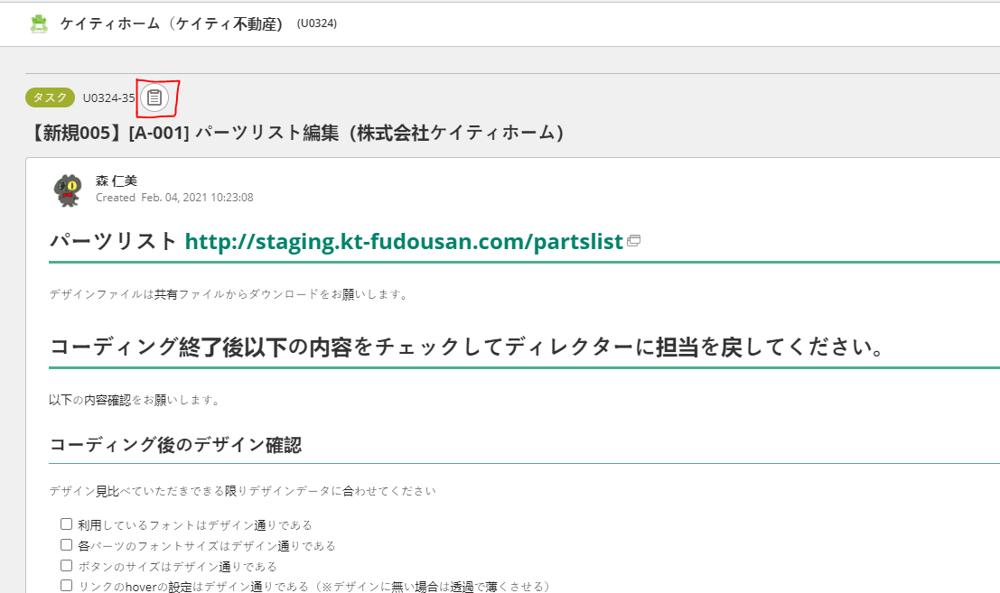
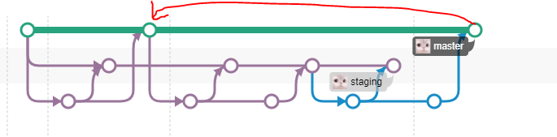
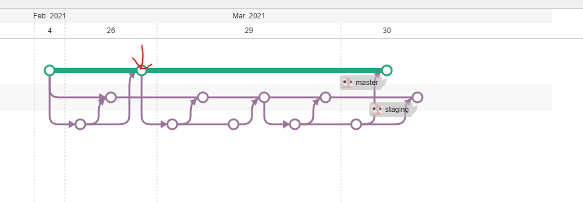
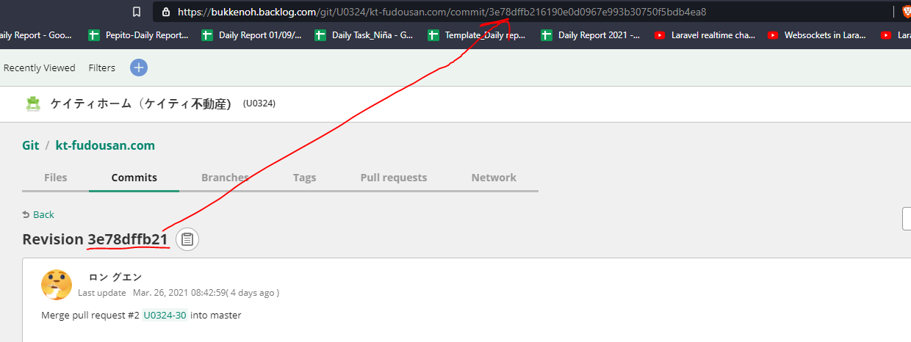

# BUKKENOH GUIDE

## GIT

__When pushing local to a issued key__

1. git add . ; git commit -m  __"copied from the issued key refer to the picture above"__;
2. git push origin  __"issued key ex. U0324-35"__;

__Create a pull request__

1. go to git tab in the issue page
2. click on pull request
3. click on plus sign
4. make sure you are pushing to the correct branch

__Revert a commit to previous commit using Force Push__

ex.

1. get the previous official commited hash of the target branch;

ex.

2.__git push origin -f commit_id:branch__ ( ex. __git push origin -f 3e78dffb216190e0d0967e993b30750f5bdb4ea8:master__  )

