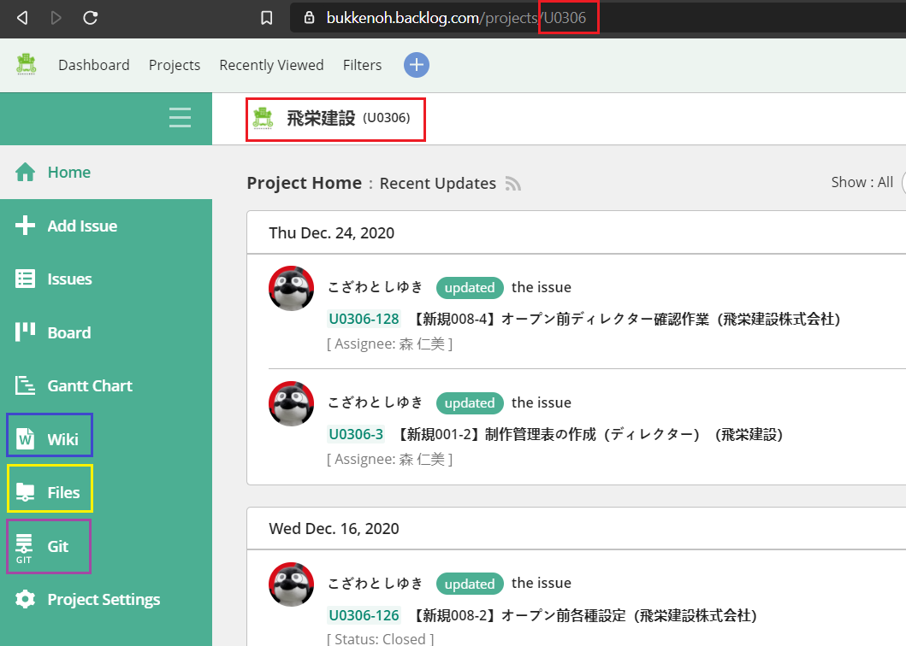

# Bukkenoh Guide

### Introduction & Purpose

This guide is for English employees.<br/>
To minimize confusion when tackling unknown characters in the code and to unify the project structure.

### Backlog Basics
The working task is registered in the backlog. The person in charge is the one who will set the project deadline and the last person to confirm the project completion.

__When Starting__

🔵 Change the status from " <span style="color:#ED8077; font-weight: bold">Open</span> " to " <span style="color:#4488C5; font-weight: bold">In Progress</span> ".

__When Confirming | Checking__

🟢 Change the status from " <span style="color:#4488C5; font-weight: bold">In Progress</span>" to " <span style="color:#5EB5A6; font-weight: bold">Resolved</span>  "<br/>
🟢 Change the assignee from " yourname " to " person in charge "

If the person in charge finished checking the status will be set to " <span style="color:#A1AF2F; font-weight: bold">Closed</span> "

### Backlog Interface

*   Project Key - The ID for the project. 

*   Wiki - Where the env config can be found.

*   Files - Where the image and the design data is located.

*   Git- Where the source code link is located. You can view your branch changes.



### Coding Basics
When the status in the backlog in change to In Progress. You can start working with the task. Usually the task list will look like below.

```

Project : U0314
|__ Parent Task ( ex. U0314-01 )
    |_ Child Task - Partslist  ( ex. U0314-02 )
    |_ Child Task - Top Page   ( ex. U0314-03 )
    |_ Child Task - Lower Page ( ex. U0314-04 )
    |_ ....
    
```

The " <span style="color:#8FB8DC">U0314-XX</span> " is called the issued key and you will be using this as branch name when creating a new branch. When updating the issude branch it would automatically notify in the issued page in backlog. 

### When Starting Coding 

Requirements:
1. PHP 7.0v || 7.2v
2. Node 8.16.0

##### Laravel Setup

1. In the `<project>/laravel` run the following command line: __`composer install`__ for laravel.
2. Edit the __`.env`__
```diff

// default
- USER_ID = 43
- STORE_ID = 124
 
// can be found in the project wiki
+ USER_ID = 123
+ STORE_ID = 123

```

3. In the `<project>/src` run the following command line: __`yarn install`__
4. After installing run the command: __`yarn watch`__

##### New Site Coding Flow

1. Clone the remote repository ( Prepared by Technical staff from property king )
2. The ( Assign Coder ) must checkout the __staging branch__ of the remote repository.
3. Create a new branch using the Issued Key as the name of the branch.<br/> :pushpin: __Note:__ when creating a new branch make sure you are creating it from the checked out __staging branch__.
4. Work on the issue mentioned in the Issue Page.
5. When finish, stage and commit all the changes made from the Issue-handling Branch to the remote repository.
6. Create a __PR__ or __Pull Request__ from the issued branch to staging.
7. Compare and check the source code on the pull request page, and merge it into the staging branch if it is OK.
8. When merge is complete, Delete the issued branch.
9. Check the staging environment site if the changes are reflected properly.
10. Ask the person in charge to do a final check in the staging environment.

##### Maintenance Coding Flow

1. Create a new branch for the issue handling __from the master branch__.
2. Work on the issue mentioned in the Issue Page.
3. When finish, stage and commit all the changes made from the Issue-handling Branch to the remote repository.
4. Create a __PR__ or __Pull Request__ from the issued branch to staging.
5. Compare and check the source code on the pull request page, and merge it into the staging branch if it is OK.
6. Check the staging environment site if the changes are reflected properly.
7. Ask the person in charge to confirm in the staging environment.
8. When you receive a request from the person in charge to apply the changes to the production environment, create a __PR__ for the issued branch in the remote repository to the master branch.
9. Compare and check the source code on the pull request page, and merge it into the master branch if it is OK.
10. When merge is successful, Delete the issued branch.

### Prohibited matters

Do not leave a backup with ".bk" or date name attached to the file.
If you want to recover from past actions, use Git's history function.
Also, do not leave unnecessary files.
If you find an unnecessary file, delete it and report it.
If you are uncertain whether it is unnecessary, check with the technical staff inside the property king.
